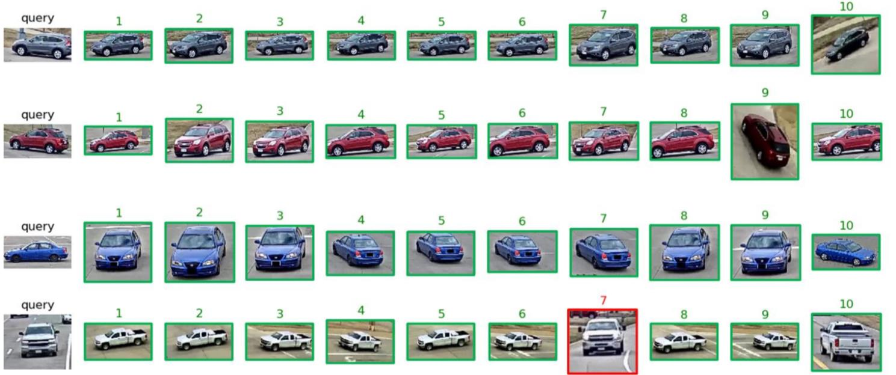

# Implementation of Vehicle Re-Identification Based on Complementary Features for 2020 AICity Challenge Track2 
This repository contains the source codes of vehicle Re-ID of our implementation for 2020 AICity Challenge, and we got 5-th place in the vehicle Re-ID track of AIC2020. [Our paper](https://arxiv.org/abs/2005.04463)
######
## Dependencies
python 2.7 / python 3.6 

pytorch 1.0 +

torchvision 0.2.1 +

metric_learn 0.5.0 +

cv2 3.0 + 
refer to our source codes for other dependencies  

## Datasets
Datasets used in our implementation are avialable at 

| Datasets        | Description | Download link                                                    |
| -------------------------- | ---------------------------------------------- | ------------------------------------------------------------ |
| Original train set       | CityFlow train set and Simulation Set by VehicleX       | [link](https://drive.google.com/file/d/1by-7hUFTzFuAyRGASlSRZwSkEwAiPhls/view?usp=sharing) |
| Crop train set for cityflow  | CityFlow train set cropped by 2019 1st Baidu's detector  |   [link](https://drive.google.com/file/d/1S_R4OgnFMB1JrSIN21ZKHsMQE1nS45NH/view?usp=sharing)  |
| All images with fake label test test | CityFlow train set & test set(fake label) and Simulation Set by VehicleX            | [link](https://drive.google.com/file/d/1Z2Zpnp0qmO2PVSmsLQigb14jUSC-Lnzg/view?usp=sharing) |


## Models
**Notes:**
You can directly use our trained model and extracted features for implementation, the link is as follows:

| Models  | Usage   | Description | Download link                                                    |
| -------------------------- | ---------------------------------------------- | ------------------------------------------------------------ |-------------------------- |
| ImageNet pretrained models  | Train     | for ```global_model/pretrain_models```       | [link](https://drive.google.com/file/d/1pcZRbtJ8iaI99nzL9W1ZxQC0yu2lEPrF/view?usp=sharing) |
| ImageNet pretrained models  | Train     | for ```mgn_model/weights```  |   [link](https://drive.google.com/file/d/1kuUS8fltZCFYOHbQtzJyG9lBXOl6cijV/view?usp=sharing)  |
| Vehicle ReID models trained by us | Test   | contain four models checkpoint mentioned in our paper   | [link](https://drive.google.com/file/d/1VWXZmHAyM5zvfLujy7s0WNKhi50Bryc6/view?usp=sharing) |

| Features  | Usage    | Description | Download link                                                    |
| -------------------------- | ---------------------------------------------- | ------------------------------------------------------------ |-------------------------- |
| Pkls for features |Test | features extracted by each model  and performed by several post-processing      | [link](https://drive.google.com/file/d/1Hag_OBDAnT-gZfklCHZG66U9gbBBuubQ/view?usp=sharing) |

## Code Structure ##

**Each part has its own README file.**

* global_model contains source codes of training vehicle reid models including se_resnext101, se_resnet152, resnet152, hrnet_48w, se_resnet152_ibnb, densenet161, dpn107, senet154 etc.

* mgn_mode contains source codes of training vehicle reid models including resnet152 with MGN, resnet152 with SAC.

* post_processing contains several post-processing methods for Re-ID task.

## Running Code orderly ##

1. Train each single model in global_model and mgn_model.

2. Extract features for test set using each single model in global_model and mgn_model.

3. Move all pkls of features to the same directory and utilize several post-processing methods to improve single model performence.

## Detail steps to reproduce our result

## Trainng

Train each single model in global_model and mgn_model.

see global_models/README.md and mgn_model/README.md for detailed training steps. 

### Testing
1 Download the vehicle ReID models trained by us from the google-drive([link](https://drive.google.com/file/d/1VWXZmHAyM5zvfLujy7s0WNKhi50Bryc6/view?usp=sharing)). 

2 unzip the downloaded file ckpt.tar in the current directory, and make a link in both `global_model` and `mgn_model` directory

3 download imagenet pretrained models([link](https://drive.google.com/file/d/1pcZRbtJ8iaI99nzL9W1ZxQC0yu2lEPrF/view?usp=sharing)) for `global_model/pretrain_models` and unzip in `global_mddel` directory

4 download imagenet pretrained models([link](https://drive.google.com/file/d/1kuUS8fltZCFYOHbQtzJyG9lBXOl6cijV/view?usp=sharing)) for `mgn_model/weights` and unzip in `mgn_mddel` directory

5 enter ```global_model``` directory, modify ```query_path``` and ```gallery_path``` in ```extract_feature_val.sh```

6 extract features using global models, the features will be saved in `post_processing/val_pkl_final`
```
sh extract_feature_val.sh
```

7 enter ```mgn_model``` directory, modify ```query_path``` and ```gallery_path``` in ```extract_feature_val.sh```

8 extract features using mgn model, the features will be saved in `post_processing/val_pkl_final`
```
sh extract_feature_val.sh
``` 

9 enter `post_processing` directory , run 
```
sh test_final.sh
``` 
 you will get `track2.txt` which is the final result

-----


## Basic framework ##

* The basic framework of our approach .  


* Results generated by our method.

